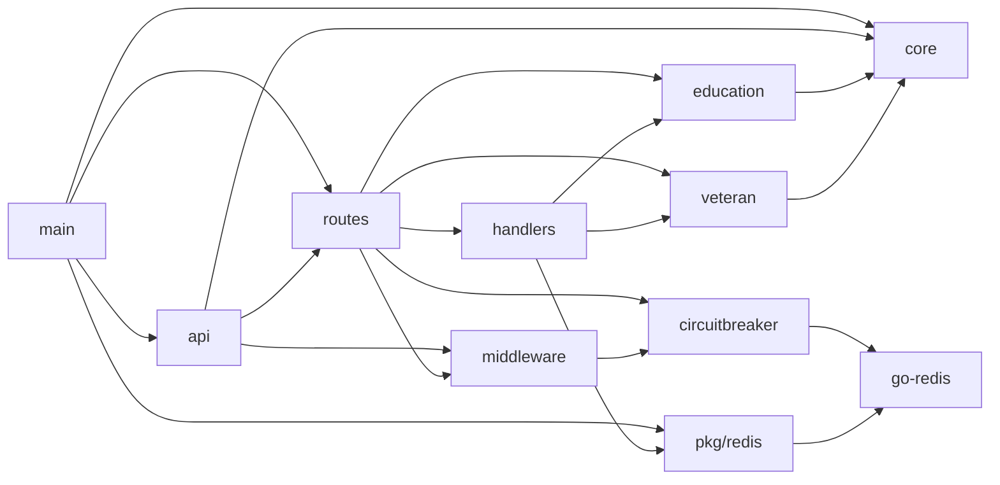

# Architecture

## Package Structure

- `main.go`
- `api/app.go`
- `api/routes/*.go`
- `api/handlers/*.go`
- `api/middleware/middleware.go`
- `pkg/core/*.go`
- `pkg/education/*.go`
- `pkg/veteran/*.go`
- `pkg/circuitbreaker/*.go`
- `pkg/redis/*.go`
- `pkg/choice/choice.go`

This page describes the current Go implementation. The intended public API
contract for the branch is defined separately in `api-spec/v0/openapi.yaml` and
`schema/v0/`.

## Dependency Relationships

## Interfaces and Abstractions

- `pkg/education/service.go`
  - `type Service interface { LookupEnrollmentStatus(ctx context.Context, req Request) (Response, error) }`
  - `type HTTPTransport interface { Do(req *http.Request) (*http.Response, error) }`
- `pkg/veteran/service.go`
  - `type Service interface { LookupDisabilityRating(ctx context.Context, req Request) (Response, error) }`
  - `type HTTPTransport interface { Do(req *http.Request) (*http.Response, error) }`
- `pkg/core/otel.go`
  - `type OtelService interface { SpanFromContext; LoggerProvider; Shutdown }`
- `pkg/circuitbreaker/circuitbreaker.go`
  - `type Breaker interface { Allow; OnSuccess; OnFailure }`

These abstractions support unit testing and integration boundary replacement
without route-layer rewrites.

## Concurrency Model

- Server lifecycle:
  - `runServer` starts `app.Listen` in a goroutine and selects on server error
    or signal context cancellation.
  - graceful shutdown uses `app.ShutdownWithTimeout(5 * time.Second)`.
- Request lifecycle:
  - handlers create per-request contexts with timeout (`/health`: 2s,
    `/api/v0/education-enrollments`: 30s,
    `/api/v0/veteran-disability-ratings`: 5s).
- Circuit-breaker middleware:
  - breaker registry map guarded with `sync.RWMutex`.
  - lazy breaker initialization via double-check lock pattern.

## Error Handling Strategy

- Global Fiber error handler (`api/errorHandler`) converts errors into HTTP
  status and plain-text message bodies.
- `fiber.NewError` is used for explicit gateway semantics in the education and
  veteran handlers.
- Wrapped errors with context (`fmt.Errorf("...: %w", err)`) are used in
  service layers.
- Circuit breaker denies with `503 Service Unavailable` when `Allow` reports an
  open circuit.
- With default `FailOpen=true`, Redis state-read or parse errors allow request
  pass-through instead of denying.
- Panic recovery middleware logs stack traces
  (`recover.Config{EnableStackTrace:true}`).

## Middleware Stack

Ordered middleware in `api.New`:

1. Request ID propagation into Fiber user context
2. Structured request logging (trace/span/request IDs)
3. Panic recovery with stack traces
4. CORS (`*` origin/headers/methods)
5. OpenTelemetry Fiber middleware
6. Optional `SkipAuthMiddleware` when `SKIP_AUTH=true`

`GET /health` is registered before the optional skip-auth middleware, so it
does not receive the injected local identity locals.

## Dependency Injection Pattern

Observed constructor and options-based DI:

- `education.New(cfg, education.Options{HTTPClient, Logger, Timeout})`
- `veteran.New(cfg, veteran.Options{HTTPClient, Logger, Timeout})`
- Current `main` call: `api.New(&api.Config{Core, Logger, Otel, Redis})`
- Circuit breaker injection via higher-order middleware factory:
  - `WithCircuitBreaker(func(name string) *RedisBreaker { ... })`

Note: `api.Config` includes a `Redis` field and the current `main` path injects
it.

## Technical Caveats (Current State)

- The current branch exposes five runtime routes: `GET /`, `GET /health`,
  `GET /api-spec/v1/verify`, `POST /api/v0/education-enrollments`, and
  `POST /api/v0/veteran-disability-ratings`.
- `SkipAuthMiddleware` is a local identity injector, not a bearer-token
  validator. The design-time auth contract in `api-spec/v0/openapi.yaml` is
  ahead of the running service.
- `/health` is intentionally reachable without the optional skip-auth
  middleware.
- Some tests require local Redis and fail when unavailable.

## Assumptions

- **High confidence:** Current layering is intentionally thin and
  integration-oriented rather than strict clean-architecture separation.
- **Medium confidence:** Additional provider adapters are expected to follow
  existing interface patterns in `pkg/education` and `pkg/veteran`.
