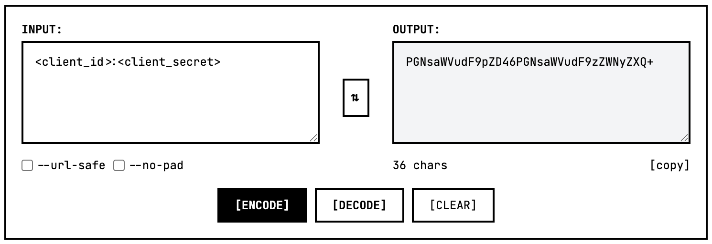

# Authenticating with the Emmy API

## Credential Format

HTTP Basic authentication is a simple HTTP header that supplies a Base64-encoded version of a username and password to the server. The two values are joined by a colon (:) and then encoded.

To perform this, simply create the following text (substituting the ```client_id``` and ```client_secret``` values with your actual credentials):

```json
<client_id>:<client_secret>
```

Now HTTP Basic authentication requires that string to be Base64 encoded. This can be easily accomplished in most coding languages. However, for simplicity, we will use a "live" online encoder that does NOT send content over the wire. **Note that you should never use this with sensitive values, such as Production credentials.** You should never share your ```client_id``` or ```client_secret```.

An online encoder such as [www.base64.sh](https://www.base64.sh/) makes quick work of Base64 encoding. Simply put the string you built earlier into the **INPUT:** side and then press the **[ENCODE]** button. You will see your Base64-encoded credentials on the **OUTPUT:** side.



You now have Base64 credentials you can use for authorization!
