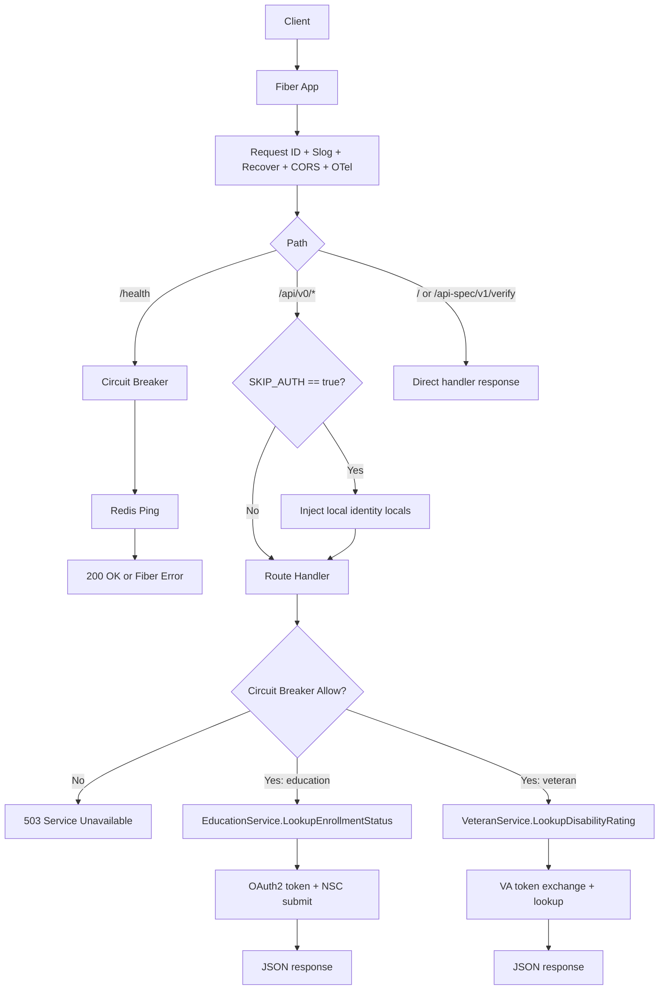

# Verification Service API Overview

## Purpose

The Verification Service API provides a unified HTTP interface for eligibility
verification workflows, currently focused on a runtime education scaffold, a
Redis-backed health check, and the checked-in v0 veteran disability contract.

This service evolved from consent-based verification work and is intended to
reduce manual burden during benefits eligibility evaluation.

The intended public API contract for this branch is defined in
`api-spec/v0/openapi.yaml` and the reusable schemas in `schema/v0/`. This page
describes the current repository and runtime shape, which still contains a mix
of contract-aligned routes and implementation scaffolding.

## System Context

Runtime dependencies in current implementation:

- Fiber (`github.com/gofiber/fiber/v2`) for HTTP server and routing.
- Redis (`github.com/redis/go-redis/v9`) for health checks and distributed circuit-breaker state.
- NSC endpoints (`NSC_TOKEN_URL`, `NSC_SUBMIT_URL`) for education verification.
- OpenTelemetry OTLP exporter for tracing/metrics/log fanout.
- Optional local identity injection via `SkipAuthMiddleware` when `SKIP_AUTH=true`.

## Key Packages

- `main`: process bootstrap, env/config load, OTel startup, Redis client init, route registration, graceful shutdown.
- `api`: Fiber app construction and shared middleware setup.
- `api/routes`: endpoint registration (`/`, `/health`, `/api-spec/v1/verify`, `/api/v0/education-enrollments`, `/api/v0/veteran-disability-ratings`).
- `api/handlers`: HTTP handlers for Redis health, education scaffolding, and veteran verification.
- `api/middleware`: circuit-breaker middleware plus local skip-auth identity injection.
- `pkg/core`: configuration, logger, OTel service abstractions/utilities.
- `pkg/education`: NSC service abstraction and HTTP/OAuth submit flow.
- `pkg/veteran`: VA service abstraction and JWT client-assertion flow.
- `pkg/circuitbreaker`: Redis-backed circuit-breaker implementation.
- `pkg/redis`: Redis client factory and health ping.

## Design Principles (Observed)

- Explicit startup configuration from environment via `core.NewConfigFromEnv()`.
- Interface-driven boundaries for integration points (`EducationService`, `HTTPTransport`, `OtelService`, `Breaker`).
- Middleware-first cross-cutting concerns (recovery, CORS, tracing, request logging, auth, circuit breaking).
- Operational defaults favoring availability in unknown breaker state (`FailOpen=true` by default).

## High-Level Request Flow

Current wiring caveat on `main`: `api.New` now receives a Redis client from
`main`, so `/health` can use the same Redis dependency that powers the breaker
and health checks.

## Documentation Map

- [Architecture](architecture.md)
- [Setup](setup.md)
- [Runtime API Notes](api.md)
- [Features](features/)
- [Research](research/)
- [Planning](planning/)
- [API Specification](../api-spec/README.md)
- [JSON Schemas](../schema/README.md)

Feature docs are categorized by domain under `features/core`,
`features/infrastructure`, `features/security`, and `features/resilience`.

## Naming Note

Initial requirements referenced `/docs/planing`; this repo standardizes on
`/docs/planning`.

## Assumptions

- **High confidence:** Redis is the only persistent/shared runtime store
  currently used by this service.
- **High confidence:** `POST /api/v0/education-enrollments` and
  `POST /api/v0/veteran-disability-ratings` are the current checked-in v0
  contract paths.
- **Medium confidence:** Additional verification domains beyond the current
  runtime routes may be introduced in future versions.
