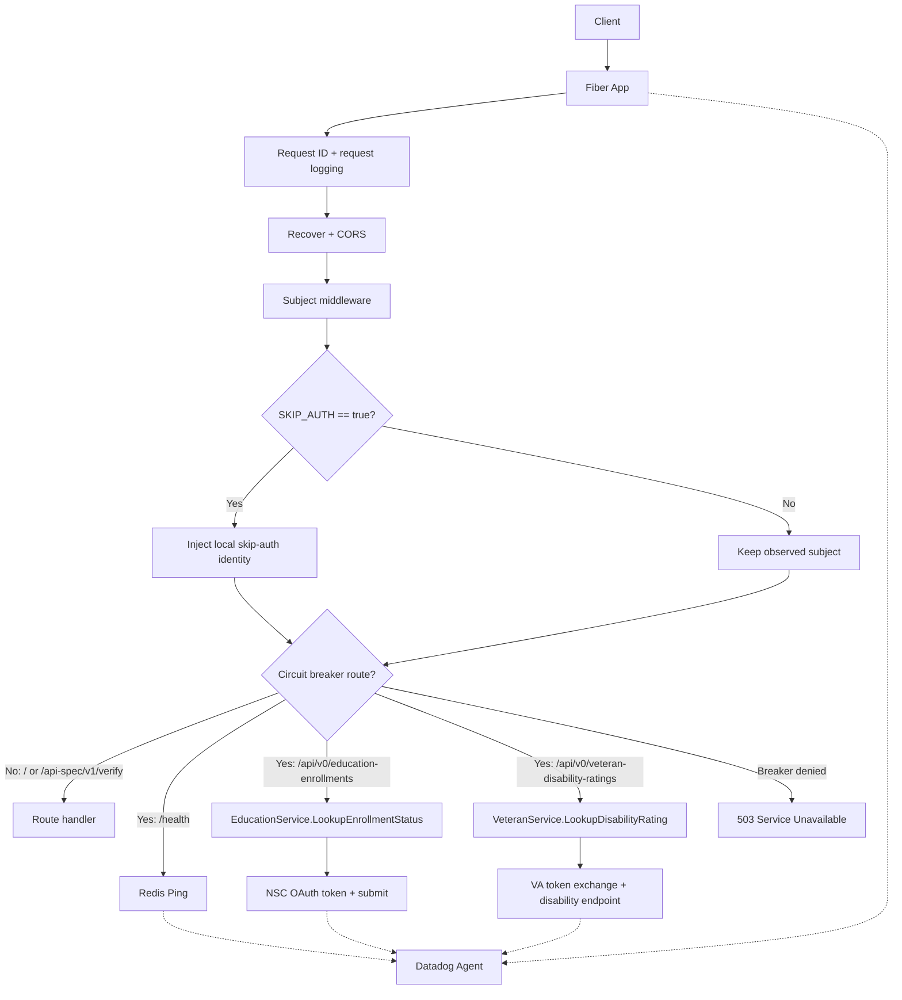

# Verification Service API Overview

## Purpose

The Verification Service API provides a unified HTTP interface for eligibility
verification workflows. The current branch exposes a Redis-backed health check,
two versioned verification endpoints, and a route that serves the bundled v0
OpenAPI artifact.

The intended public contract for this branch is defined in
`api-spec/v0/openapi.yaml` and the reusable schemas in `schema/v0/`. This page
describes the current repository and runtime shape, including places where the
implementation has not yet caught up to the documented contract.

## System Context

Runtime dependencies in the current implementation:

- Fiber (`github.com/gofiber/fiber/v2`) for HTTP server and routing
- Redis (`github.com/redis/go-redis/v9`) for startup health checks and
  distributed circuit-breaker state
- NSC endpoints (`NSC_TOKEN_URL`, `NSC_SUBMIT_URL`) for education verification
- VA endpoints (`VA_TOKEN_URL`, `VA_BASE_URL`) for veteran disability lookups
- Datadog Orchestrion for build-time automatic instrumentation

## Key Packages

- `main`: process bootstrap, env/config load, Redis init, route registration,
  graceful shutdown
- `api`: Fiber app construction and shared middleware setup
- `api/routes`: endpoint registration (`/`, `/health`, `/api-spec/v1/verify`,
  `POST /api/v0/education-enrollments`,
  `POST /api/v0/veteran-disability-ratings`)
- `api/handlers`: HTTP handlers for Redis health, bundled OpenAPI serving,
  education verification, and veteran verification
- `api/middleware`: request subject extraction, local skip-auth identity, and
  circuit-breaker middleware
- `pkg/core`: configuration and logger setup
- `pkg/education`: NSC service abstraction and HTTP/OAuth submit flow
- `pkg/veteran`: VA service abstraction and JWT client-assertion flow
- `pkg/circuitbreaker`: Redis-backed circuit-breaker implementation
- `pkg/redis`: Redis client factory and health ping helper

## Design Principles (Observed)

- Explicit startup configuration from environment via `core.NewConfigFromEnv()`
- Interface-driven boundaries for integration points (`Service`,
  `HTTPTransport`, `Breaker`)
- Middleware-first cross-cutting concerns for request IDs, logging, panic
  recovery, CORS, subject propagation, and breaker checks
- Operational defaults favoring availability in unknown breaker state
  (`FailOpen=true`)

## High-Level Request Flow

## Documentation Map

- [Architecture](architecture.md)
- [Setup](setup.md)
- [Runtime API Notes](api.md)
- [Features](features/)
- [Research](research/)
- [Planning](planning/)
- [API Specification](../api-spec/README.md)
- [JSON Schemas](../schema/README.md)

Feature docs are categorized by domain under `features/core`,
`features/infrastructure`, `features/security`, and `features/resilience`.

## Naming Note

Initial requirements referenced `/docs/planing`; this repo standardizes on
`/docs/planning`.

## Assumptions

- **High confidence:** Redis is the only shared runtime store currently used by
  this service.
- **High confidence:** The versioned verification endpoints in the current
  branch are `POST /api/v0/education-enrollments` and
  `POST /api/v0/veteran-disability-ratings`.
- **Medium confidence:** The checked-in v0 auth contract is ahead of runtime
  enforcement and should be read alongside [Runtime API Notes](api.md).
