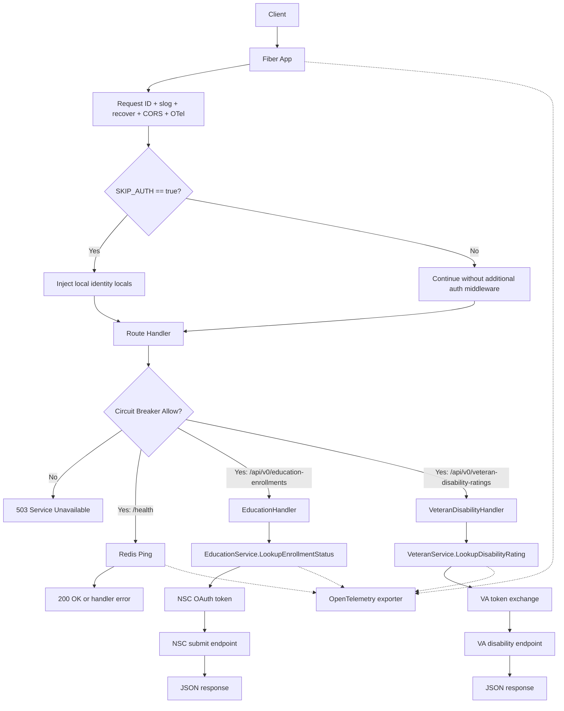

# Verification Service API Overview

## Purpose

The Verification Service API provides a unified HTTP interface for eligibility
verification workflows, currently centered on Redis-backed health checks, a
versioned education enrollment endpoint, and a versioned veteran disability
endpoint.

This service evolved from consent-based verification work and is intended to
reduce manual burden during benefits eligibility evaluation.

The intended public API contract for this branch is defined in
`api-spec/v0/openapi.yaml` and the reusable schemas in `schema/v0/`. This page
describes the current repository and runtime shape on the checked-out branch.

## System Context

Runtime dependencies in current implementation:

- Fiber (`github.com/gofiber/fiber/v2`) for HTTP server and routing.
- Redis (`github.com/redis/go-redis/v9`) for startup health checks and
  distributed circuit-breaker state.
- NSC endpoints (`NSC_TOKEN_URL`, `NSC_SUBMIT_URL`) for education verification.
- VA endpoints (`VA_TOKEN_URL`, `VA_BASE_URL`) for veteran verification.
- Optional local skip-auth identity injection when `SKIP_AUTH=true`.
- OpenTelemetry OTLP exporter for tracing/metrics/log fanout.

## Key Packages

- `main`: process bootstrap, env/config load, OTel startup, Redis client init,
  route registration, graceful shutdown.
- `api`: Fiber app construction and shared middleware setup.
- `api/routes`: endpoint registration (`/`, `/health`, `/api-spec/v1/verify`,
  `/api/v0/education-enrollments`, `/api/v0/veteran-disability-ratings`).
- `api/handlers`: HTTP handlers for Redis health, education verification,
  OpenAPI artifact serving, and veteran verification.
- `api/middleware`: skip-auth identity injection and circuit-breaker
  middleware.
- `pkg/core`: configuration, logger, OTel service abstractions/utilities.
- `pkg/education`: NSC service abstraction and HTTP/OAuth submit flow.
- `pkg/veteran`: VA service abstraction and JWT client-assertion flow.
- `pkg/circuitbreaker`: Redis-backed circuit-breaker implementation.
- `pkg/redis`: Redis client factory and health ping.

## Design Principles (Observed)

- Explicit startup configuration from environment via `core.NewConfigFromEnv()`.
- Interface-driven boundaries for provider integrations and shared services.
- Middleware-first cross-cutting concerns for request IDs, logging, recovery,
  tracing, optional local identity injection, and breaker checks.
- Operational startup fails fast when Redis is unavailable.

## High-Level Request Flow

`main` injects the same Redis client into `api.New` and `routes.RegisterRoutes`,
so startup health checks, `/health`, and breaker state share a single runtime
dependency.

## Documentation Map

- [Architecture](architecture.md)
- [Setup](setup.md)
- [Runtime API Notes](api.md)
- [Features](features/)
- [Research](research/)
- [Planning](planning/)
- [API Specification](../api-spec/README.md)
- [JSON Schemas](../schema/README.md)

Feature docs are categorized by domain under `features/core`,
`features/infrastructure`, `features/security`, and `features/resilience`.

## Naming Note

Initial requirements referenced `/docs/planing`; this repo standardizes on
`/docs/planning`.

## Assumptions

- **High confidence:** Redis is the only persistent/shared runtime store
  currently used by this service.
- **High confidence:** The branch exposes both checked-in v0 verification
  routes at `POST /api/v0/education-enrollments` and
  `POST /api/v0/veteran-disability-ratings`.
- **High confidence:** `SKIP_AUTH` currently controls local identity injection,
  not a real bearer-token verifier toggle.
